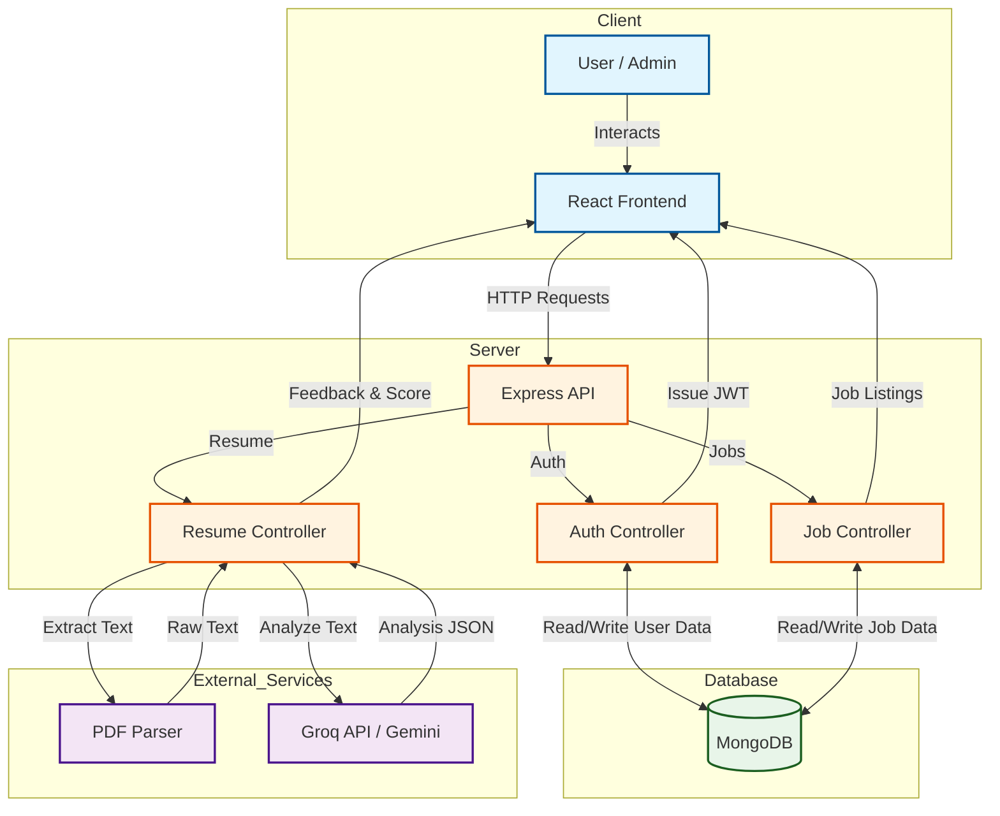

# 🚀 Skill2Hire - AI-Powered Recruitment Platform

[](https://github.com/AnkitGit-prog/skill2hire)
[](https://groq.com)
[](LICENSE)

**Skill2Hire** is a next-generation job portal and recruitment platform designed to streamline the hiring process using Artificial Intelligence. It features an intelligent **Resume Analyzer** that scores candidates against job descriptions, suggesting improvements and highlighting strengths.

---

## 🌟 Key Features

- **🤖 AI Resume Analysis**: Automatically evaluates resumes using **Groq (Llama 3)** & **Gemini** to provide detailed feedback, scores, and missing keywords.
- **🔐 Secure Authentication**: Robust JWT-based authentication with role-based access control (Admin vs. User).
- **💼 Job Management System**: Admins can post, edit, and manage job listings efficiently.
- **📄 PDF Parsing**: Built-in support for extracting text from PDF resumes for analysis.
- **⚡ High Performance**: Built on **Vite** + **React** for a blazing fast frontend experience.
- **🎨 Modern UI**: Responsive design using **Bootstrap** and **Framer Motion** for smooth animations.

---

## 🛠️ Tech Stack

### Frontend


### Backend


### AI & Tools


---

## 🔄 System Workflow

The following diagram illustrates how the Resume Analysis feature works:



---

## 🚀 Getting Started

### Prerequisites
- Node.js (v16+)
- MongoDB (Atlas or Local)
- Groq API Key

### Installation

1. **Clone the repository**
   ```bash
   git clone https://github.com/AnkitGit-prog/skill2hire.git
   cd skill2hire
   ```

2. **Setup Backend**
   ```bash
   cd server
   npm install
   ```
   *Create a `.env` file in `server/` root:*
   ```env
   PORT=5000
   MONGO_URI=your_mongodb_connection_string
   JWT_SECRET=your_secret_key
   GROQ_API_KEY=your_groq_api_key
   ```
   *Start the server:*
   ```bash
   npm start
   ```

3. **Setup Frontend**
   ```bash
   cd ../client
   npm install
   ```
   *Start the client:*
   ```bash
   npm run dev
   ```

---

## 👥 Contributing

Contributions are welcome! Please follow these steps:
1. Fork the project.
2. Create your feature branch (`git checkout -b feature/AmazingFeature`).
3. Commit your changes (`git commit -m 'Add some AmazingFeature'`).
4. Push to the branch (`git push origin feature/AmazingFeature`).
5. Open a Pull Request.

---

## 📄 License

Distributed under the MIT License. See `LICENSE` for more information.

---

<p align="center">
  Made with ❤️ by <a href="https://github.com/AnkitGit-prog">Ankit Tiwari</a>
</p>
